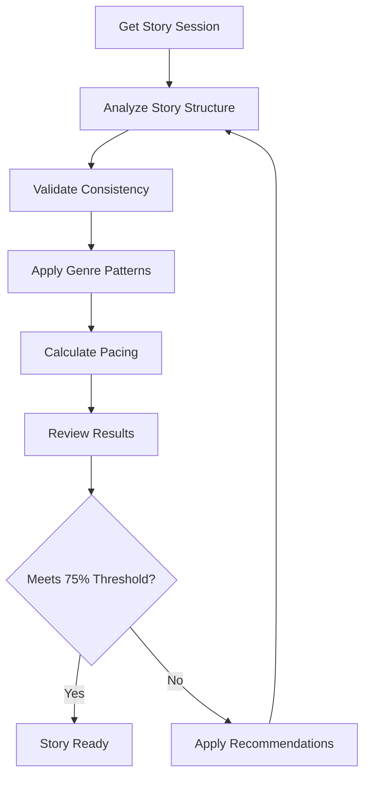
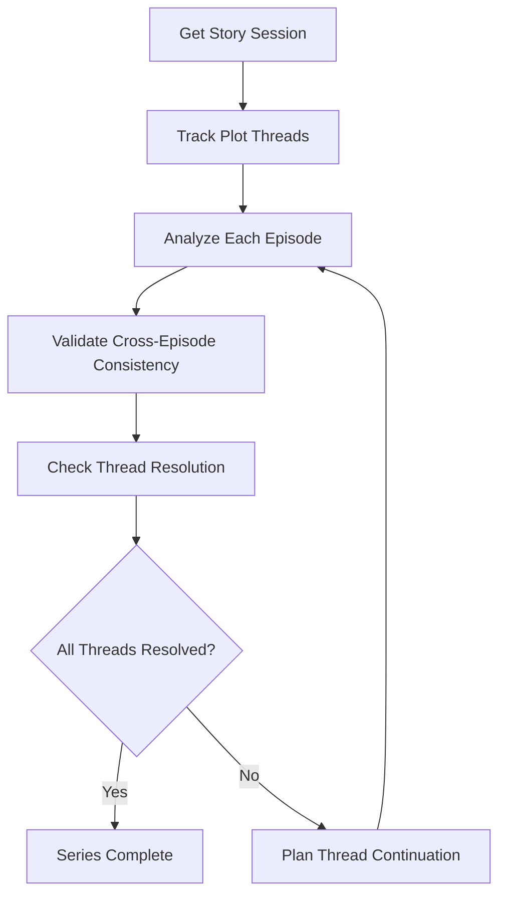
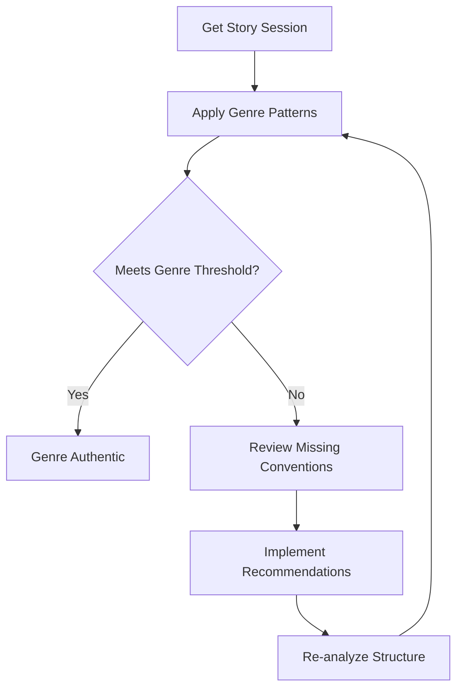

# How to Use MCP Story Service

## Overview

The MCP Story Service is a standalone narrative intelligence server that provides AI agents with comprehensive story analysis capabilities. This service follows the Model Context Protocol (MCP) and offers tools for story structure analysis, plot validation, consistency checking, genre pattern matching, and pacing analysis.

> **⚠️ DEVELOPMENT STATUS**: This service is currently in active development. Many features are implemented as mock/placeholder implementations. See the [Implementation Status](#implementation-status) section for details on what's complete vs. in development.

## Table of Contents

- [Implementation Status](#implementation-status)
- [Quick Start](#quick-start)
- [Service Architecture](#service-architecture)
- [Available Tools](#available-tools)
- [Workflows](#workflows)
- [Error Handling](#error-handling)
- [Best Practices](#best-practices)
- [Examples](#examples)

## Implementation Status

### ✅ **Completed Features**
- **MCP Server Core**: Basic MCP protocol server with tool registration
- **Session Management**: Story session creation and persistence (with Redis backend)
- **Genre Configuration**: 15+ genre templates loaded from YAML files
- **Basic Tool Handlers**: All 6 MCP tools have handler implementations
- **Data Models**: Complete story entities (Arc, Thread, Beat, Journey, etc.)
- **Project Structure**: Full source code organization and configuration

### 🔄 **Mock/Placeholder Implementations**
> **These features have basic structure but need full implementation:**

- **Story Structure Analysis**: Currently returns hardcoded three-act structure
- **Plot Thread Tracking**: Basic thread lifecycle tracking with mock analysis
- **Consistency Validation**: Simple timeline validation, needs comprehensive rule engine
- **Genre Pattern Matching**: Basic convention checking, needs full pattern analysis
- **Pacing Calculation**: Mock tension curve generation, needs real analysis algorithms
- **Process Isolation**: Session isolation framework exists but not fully implemented

### ❌ **Missing Features**
- **Real Analysis Algorithms**: All core analysis logic is placeholder/mock
- **Advanced Error Handling**: Basic error handling, needs comprehensive coverage
- **Performance Optimization**: No caching, optimization, or performance tuning
- **Integration Testing**: Limited integration test coverage
- **Production Deployment**: No deployment configuration or Docker setup

### 🐛 **Known Issues**
- **Parameter Handling Bug**: MCP tool handlers expect individual parameters but server passes arguments object - needs fixing
- **Session Serialization**: Redis session storage may have serialization issues with complex objects
- **Genre Template Loading**: Error handling for missing or malformed genre YAML files needs improvement

## Quick Start

### Prerequisites

- Python 3.11+
- Redis server (for session management)
- MCP-compatible client
- Poetry (for dependency management)

### Installation

> **⚠️ NOTE**: This project uses Poetry for dependency management, not pip with requirements.txt

```bash
# Clone the repository
git clone <repository-url>
cd mcp-story-service

# Install Poetry if not already installed
curl -sSL https://install.python-poetry.org | python3 -

# Install dependencies using Poetry
poetry install

# Start Redis server (required for session management)
redis-server

# Start the service
poetry run python -m src.mcp.server
```

> **🚧 DEVELOPMENT STATUS**: The service will start but most analysis features return mock data. See [Implementation Status](#implementation-status) for details.

### Basic Usage

1. **Create a story session** for project isolation
2. **Analyze story structure** to identify three-act progression
3. **Validate consistency** to detect plot holes
4. **Apply genre patterns** to ensure authenticity
5. **Calculate pacing** for optimal tension curves

## Service Architecture

### Core Principles

- **Process Isolation**: Each project runs in isolated context
- **75% Confidence Threshold**: All recommendations meet quality standards
- **Session Persistence**: State maintained until project completion
- **Malformed Content Handling**: Graceful degradation for invalid inputs

### Supported Genres

thriller, drama, comedy, action, horror, romance, sci-fi, fantasy, mystery, western, war, historical, biographical, documentary, animation

## Available Tools

### 1. get_story_session

**Purpose**: Create or retrieve a story analysis session for project continuity.

**Implementation Status**: ✅ **Fully Implemented**

**Parameters**:
```json
{
  "project_id": "string" // Unique project identifier
}
```

**Response**:
```json
{
  "session": {
    "session_id": "sess_abc123",
    "project_id": "my-thriller-project",
    "active_story_arcs": ["main_arc", "subplot_1"],
    "last_activity": "2024-01-15T10:30:00Z",
    "session_status": "active",
    "process_isolation_active": true,
    "persistence_policy": "until_completion"
  }
}
```

**Usage**:
- Always call this first to establish project isolation
- Sessions persist until explicit termination
- Each project gets independent analysis context

**⚠️ Current Implementation Note**: Due to a parameter handling bug, the actual tool call format may differ from documentation. The handlers expect individual parameters but receive an arguments object.

---

### 2. analyze_story_structure

**Purpose**: Analyze story structure and identify three-act progression with genre-specific variations.

**Implementation Status**: 🔄 **Mock Implementation** - Returns hardcoded three-act structure with placeholder confidence scores. Real analysis algorithms not yet implemented.

**Parameters**:
```json
{
  "story_content": "Your story outline or content...",
  "genre": "thriller", // Optional: thriller, drama, comedy, etc.
  "project_id": "my-project-001"
}
```

**Response**:
```json
{
  "arc_analysis": {
    "act_structure": {
      "act_one": {
        "start_position": 0.0,
        "end_position": 0.25,
        "purpose": "Setup and character introduction",
        "key_events": ["opening hook", "inciting incident"]
      },
      "act_two": {
        "start_position": 0.25,
        "end_position": 0.75,
        "purpose": "Development and escalating conflict",
        "key_events": ["first plot point", "midpoint", "second plot point"]
      },
      "act_three": {
        "start_position": 0.75,
        "end_position": 1.0,
        "purpose": "Climax and resolution",
        "key_events": ["climax", "resolution"]
      },
      "confidence_score": 0.87
    },
    "turning_points": [
      {
        "position": 0.25,
        "type": "plot_point_1",
        "description": "Protagonist commits to the journey",
        "confidence": 0.9
      }
    ],
    "genre_compliance": {
      "authenticity_score": 0.82,
      "meets_threshold": true,
      "conventions_met": ["escalating tension", "clear stakes"],
      "conventions_missing": ["red herring"],
      "recommendations": ["Add misdirection element"]
    },
    "pacing_analysis": {
      "tension_curve": [0.2, 0.4, 0.7, 0.9, 1.0, 0.3],
      "pacing_issues": ["Rapid resolution"],
      "suggested_improvements": ["Extend climax sequence"],
      "confidence_score": 0.78
    }
  }
}
```

**Quality Indicators**:
- `confidence_score >= 0.75`: Meets quality threshold
- `meets_threshold: true`: Passes genre authenticity check
- Higher confidence = better structured story

---

### 3. track_plot_threads

**Purpose**: Track plot threads across multiple episodes and identify lifecycle status.

**Implementation Status**: 🔄 **Mock Implementation** - Basic thread lifecycle tracking with hardcoded confidence scores. Advanced thread analysis and dependency tracking not implemented.

**Parameters**:
```json
{
  "project_id": "series-project-001",
  "threads": [
    {
      "id": "thread_001",
      "name": "Main investigation",
      "type": "main",
      "episodes": [1, 2, 3, 4, 5],
      "current_stage": "developing"
    },
    {
      "name": "Romance subplot",
      "type": "romance",
      "episodes": [2, 4, 5],
      "current_stage": "introduced"
    }
  ],
  "episode_range": {
    "start": 1,
    "end": 5
  }
}
```

**Response**:
```json
{
  "thread_analysis": [
    {
      "thread_id": "thread_main_investigation",
      "lifecycle_stage": "developing",
      "confidence_score": 0.85,
      "resolution_opportunities": [
        "Resolve investigation in episode 5",
        "Provide satisfying closure"
      ],
      "dependencies": [],
      "importance_score": 0.9,
      "suggested_actions": [
        "Plan climactic revelation",
        "Ensure character motivations clear"
      ]
    }
  ],
  "overall_assessment": {
    "total_threads": 2,
    "unresolved_threads": 1,
    "abandoned_threads": 0,
    "narrative_cohesion_score": 0.82,
    "confidence_score": 0.88
  }
}
```

**Thread Lifecycle Stages**:
- `introduced`: Thread has been established
- `developing`: Thread is actively progressing
- `ready_for_resolution`: Thread can be concluded
- `resolved`: Thread has been completed
- `abandoned`: Thread was dropped (flagged for attention)

---

### 4. validate_consistency

**Purpose**: Validate narrative consistency and detect plot holes, timeline issues, character contradictions.

**Implementation Status**: 🔄 **Basic Implementation** - Simple timeline validation only. Comprehensive consistency rules, character contradiction detection, and world-building validation not yet implemented.

**Parameters**:
```json
{
  "project_id": "consistency-check-001",
  "story_elements": {
    "characters": [
      {
        "name": "Detective Sarah",
        "role": "protagonist",
        "introduced": "episode_1",
        "attributes": {
          "age": 35,
          "rank": "Detective",
          "experience": "10 years"
        }
      }
    ],
    "events": [
      {
        "id": "event_1",
        "description": "Sarah discovers evidence",
        "episode": 1,
        "timestamp": "day_1_morning",
        "location": "police_station",
        "characters": ["Detective Sarah"]
      }
    ],
    "world_details": [
      {
        "aspect": "police_protocol",
        "description": "Standard procedures followed",
        "consistency_rule": "Officers follow established protocols"
      }
    ],
    "timeline": [
      {"event": "Discovery", "day": 1, "time": "morning"}
    ]
  },
  "validation_scope": ["timeline", "character", "world", "plot"]
}
```

**Response**:
```json
{
  "consistency_report": {
    "overall_score": 0.78,
    "confidence_score": 0.85,
    "issues": [
      {
        "type": "timeline",
        "severity": "major",
        "description": "Character knows information before discovery event",
        "location": "episode_2, scene_3",
        "suggested_fix": "Add scene showing information transfer",
        "confidence_impact": 0.15
      }
    ],
    "strengths": [
      "Clear character motivations",
      "Consistent world rules"
    ],
    "recommendations": [
      "Review information flow between characters",
      "Verify timeline consistency across episodes"
    ]
  }
}
```

**Severity Levels**:
- `critical`: Major plot holes affecting story logic
- `major`: Significant inconsistencies requiring attention
- `minor`: Small issues that could be improved

---

### 5. apply_genre_patterns

**Purpose**: Apply genre-specific storytelling conventions and provide authenticity recommendations.

**Implementation Status**: 🔄 **Basic Implementation** - Loads genre templates and performs basic convention checking. Advanced pattern matching, authenticity scoring, and detailed recommendations not fully implemented.

**Parameters**:
```json
{
  "project_id": "genre-analysis-001",
  "genre": "thriller",
  "story_beats": [
    {
      "position": 0.1,
      "type": "opening_hook",
      "description": "Mysterious murder discovered"
    }
  ],
  "character_types": [
    {
      "name": "Detective Sarah",
      "role": "protagonist",
      "archetype": "reluctant_hero"
    }
  ]
}
```

**Response**:
```json
{
  "genre_guidance": {
    "convention_compliance": {
      "score": 0.83,
      "meets_threshold": true,
      "confidence_score": 0.87,
      "met_conventions": [
        "Escalating tension",
        "Clear protagonist motivation",
        "Ticking clock element"
      ],
      "missing_conventions": [
        "Red herring subplot",
        "False ending"
      ]
    },
    "authenticity_improvements": [
      {
        "aspect": "pacing",
        "current_state": "Steady progression",
        "recommendation": "Add moments of false security",
        "impact": "medium",
        "confidence": 0.82
      }
    ],
    "genre_specific_beats": [
      {
        "beat_type": "thriller_escalation",
        "suggested_position": 0.6,
        "purpose": "Increase stakes and urgency",
        "examples": ["Discovery puts protagonist in danger"],
        "confidence": 0.88
      }
    ]
  }
}
```

**Impact Levels**:
- `high`: Significant improvement to genre authenticity
- `medium`: Moderate enhancement
- `low`: Minor refinement

---

### 6. calculate_pacing

**Purpose**: Calculate story pacing and tension curves to identify pacing issues.

**Implementation Status**: 🔄 **Mock Implementation** - Returns basic tension curve from input beats. Advanced pacing analysis, rhythm detection, and genre-specific pacing recommendations not implemented.

**Parameters**:
```json
{
  "project_id": "pacing-analysis-001",
  "narrative_beats": [
    {
      "position": 0.1,
      "type": "opening",
      "emotional_impact": 0.3,
      "tension_level": 0.2
    },
    {
      "position": 0.5,
      "type": "midpoint",
      "emotional_impact": 0.8,
      "tension_level": 0.9
    }
  ],
  "target_genre": "thriller"
}
```

**Response**:
```json
{
  "pacing_analysis": {
    "tension_curve": [0.2, 0.4, 0.7, 0.9, 1.0, 0.3],
    "pacing_score": 0.81,
    "confidence_score": 0.86,
    "rhythm_analysis": {
      "fast_sections": [
        {"start": 0.7, "end": 0.9, "intensity": "high"}
      ],
      "slow_sections": [
        {"start": 0.9, "end": 1.0, "purpose": "denouement"}
      ],
      "balanced_sections": [
        {"start": 0.0, "end": 0.3, "purpose": "setup"}
      ]
    },
    "recommendations": [
      "Consider adding breathing room before climax",
      "Extend resolution for better emotional payoff"
    ],
    "genre_compliance": 0.79
  }
}
```

## Workflows

> **⚠️ WORKFLOW STATUS**: These workflows are documented based on the intended design. Due to mock implementations, actual results will be placeholder data until full implementation is complete.

### Workflow 1: Complete Story Analysis



### Workflow 2: Multi-Episode Series



### Workflow 3: Genre Optimization



## Error Handling

### Common Error Scenarios

#### 1. Low Confidence Scores

**Scenario**: Analysis returns confidence < 0.75

**Response**:
```json
{
  "confidence_score": 0.62,
  "meets_threshold": false,
  "issues": ["Unclear story structure", "Weak character motivations"],
  "recommendations": [
    "Strengthen act transitions",
    "Clarify protagonist goals"
  ]
}
```

**Action**: Apply recommendations and re-analyze

#### 2. Malformed Content

**Scenario**: Invalid or incomplete story data

**Response**:
```json
{
  "confidence_score": 0.25,
  "analysis_status": "partial",
  "issues": ["Incomplete character data", "Missing story elements"],
  "partial_results": {
    "structure_detected": false,
    "basic_elements": ["protagonist identified"]
  }
}
```

**Action**: Provide more complete story data

#### 3. Session Not Found

**Scenario**: Invalid session_id or expired session

**Response**:
```json
{
  "error": "Session not found",
  "error_code": "SESSION_NOT_FOUND",
  "suggestion": "Create new session with get_story_session"
}
```

**Action**: Create new session

### Error Recovery Patterns

1. **Graceful Degradation**: Service provides partial results when possible
2. **Confidence Impact**: Errors reduce confidence scores appropriately
3. **Specific Recommendations**: Actionable guidance for improvement
4. **Session Recovery**: Ability to recreate sessions and continue work

## Best Practices

### 1. Session Management

- Always start with `get_story_session`
- Use consistent `project_id` throughout workflow
- Sessions persist until explicit termination
- One session per project for proper isolation

### 2. Quality Thresholds

- Aim for confidence scores ≥ 0.75
- Address all `critical` and `major` consistency issues
- Implement high-impact genre recommendations
- Validate pacing matches target genre

### 3. Iterative Improvement

- Start with basic structure analysis
- Apply recommendations systematically
- Re-analyze after each improvement cycle
- Track confidence score improvements

### 4. Multi-Episode Projects

- Track all plot threads explicitly
- Validate consistency across episodes
- Plan thread resolution timeline
- Monitor narrative cohesion scores

### 5. Genre Authenticity

- Use appropriate genre templates
- Implement missing conventions
- Balance genre expectations with originality
- Consider audience expectations

## Examples

### Example 1: Analyzing a Thriller Short Story

> **⚠️ EXAMPLE STATUS**: This example will work with the current implementation but will return mock/placeholder data.

```python
# 1. Create session (✅ Works with real implementation)
session_response = await mcp_client.call_tool("get_story_session", {
    "project_id": "thriller-short-001"
})

# 2. Analyze structure (🔄 Returns mock three-act structure)
structure_response = await mcp_client.call_tool("analyze_story_structure", {
    "story_content": "Detective finds body. Investigation reveals conspiracy. Final confrontation.",
    "genre": "thriller",
    "project_id": "thriller-short-001"
})

# 3. Check genre compliance (🔄 Returns basic genre template matching)
genre_response = await mcp_client.call_tool("apply_genre_patterns", {
    "project_id": "thriller-short-001",
    "genre": "thriller"
})

# 4. Validate results (⚠️ Will always show mock confidence scores)
if structure_response["arc_analysis"]["act_structure"]["confidence_score"] >= 0.75:
    print("Story structure meets quality threshold")  # Will likely always print this
else:
    print("Improvements needed:", structure_response["recommendations"])
```

### Example 2: Multi-Episode Series Planning

```python
# 1. Create session for series
session = await mcp_client.call_tool("get_story_session", {
    "project_id": "detective-series-s1"
})

# 2. Define plot threads
threads = [
    {
        "name": "Main murder investigation",
        "type": "main",
        "episodes": [1, 2, 3, 4, 5],
        "current_stage": "developing"
    },
    {
        "name": "Detective's personal demons",
        "type": "character_arc", 
        "episodes": [1, 3, 5],
        "current_stage": "introduced"
    }
]

# 3. Track thread progression
tracking_response = await mcp_client.call_tool("track_plot_threads", {
    "project_id": "detective-series-s1",
    "threads": threads,
    "episode_range": {"start": 1, "end": 5}
})

# 4. Check for abandoned threads
assessment = tracking_response["overall_assessment"]
if assessment["abandoned_threads"] > 0:
    print("Warning: Some plot threads may be abandoned")
```

### Example 3: Consistency Validation

```python
# Define story elements with potential issues
story_elements = {
    "characters": [
        {
            "name": "Sarah",
            "attributes": {"age": 30, "rank": "Detective"}
        }
    ],
    "events": [
        {
            "id": "event_1",
            "description": "Sarah makes arrest",
            "timestamp": "day_1",
            "location": "outside_jurisdiction"  # Potential issue
        }
    ],
    "world_details": [
        {
            "aspect": "jurisdiction",
            "consistency_rule": "Detectives only arrest within jurisdiction"
        }
    ]
}

# Validate consistency
consistency_response = await mcp_client.call_tool("validate_consistency", {
    "project_id": "consistency-check-001",
    "story_elements": story_elements
})

# Check for violations
violations = consistency_response["consistency_report"]["issues"]
for violation in violations:
    if violation["severity"] in ["critical", "major"]:
        print(f"Fix needed: {violation['description']}")
        print(f"Suggestion: {violation['suggested_fix']}")
```

## Integration Notes

> **⚠️ INTEGRATION WARNING**: Due to mock implementations, integration should be limited to development/testing until full implementation is complete.

### For AI Agents

- Use structured prompts to extract story elements
- ⚠️ **Mock Data**: Confidence scores are currently hardcoded - don't rely on them for real decisions
- Cache session IDs for project continuity (✅ This works correctly)
- ⚠️ **Limited Analysis**: Current analysis is placeholder - implement fallback logic

### For Production Systems

- ❌ **Not Production Ready**: Service has mock implementations and limited error handling
- ⚠️ **Redis Required**: Ensure Redis server is running for session management
- ⚠️ **No Performance Optimization**: No caching, connection pooling, or optimization implemented
- ❌ **Limited Monitoring**: Basic error handling only, no comprehensive monitoring

### For Development Teams

- ✅ **Good for Prototyping**: Service structure is solid for development and testing
- ⚠️ **Mock Results**: All analysis results are placeholder data
- ❌ **No Quality Gates**: Confidence thresholds are not meaningful with mock data
- 🔄 **Incremental Development**: Can be used to test integration patterns while real analysis is developed

## Support and Troubleshooting

### Performance Considerations

- ⚠️ **Mock Performance**: Current response times are fast due to mock implementations
- ✅ **Session Management**: Sessions are lightweight and can be created frequently
- ⚠️ **No Load Testing**: Concurrent request handling not yet tested
- 🔄 **Future Optimization**: Real analysis algorithms will require performance tuning

### Common Issues

1. **Missing Dependencies**: Ensure Poetry and Redis are installed and running
2. **Import Errors**: Run `poetry install` to install all dependencies
3. **Redis Connection**: Verify Redis server is running on default port (6379)
4. **Mock Data Confusion**: Remember that analysis results are placeholder data
5. **Genre Template Errors**: Ensure config/genres directory contains YAML files

### Getting Help

- Check service logs for detailed error information
- Verify Redis server is running: `redis-cli ping` should return "PONG"
- Ensure all required parameters are provided in tool calls
- ⚠️ **Development Status**: Many issues may be due to incomplete implementations

## Development Roadmap

### Next Steps for Full Implementation

1. **Real Analysis Algorithms**
   - Implement actual story structure analysis using NLP
   - Build comprehensive consistency validation rules
   - Develop genre-specific pattern matching algorithms
   - Create advanced pacing analysis with tension curve calculation

2. **Production Readiness**
   - Add comprehensive error handling and logging
   - Implement performance optimization and caching
   - Add monitoring and health check endpoints
   - Create Docker deployment configuration

3. **Testing & Quality**
   - Expand unit test coverage beyond basic contract tests
   - Add integration tests with real story content
   - Implement end-to-end workflow testing
   - Add performance and load testing

---

**⚠️ CURRENT STATUS**: This service provides a solid foundation and working MCP protocol implementation, but core analysis features are mock implementations. It's suitable for development, testing, and integration work, but not for production story analysis until real algorithms are implemented.